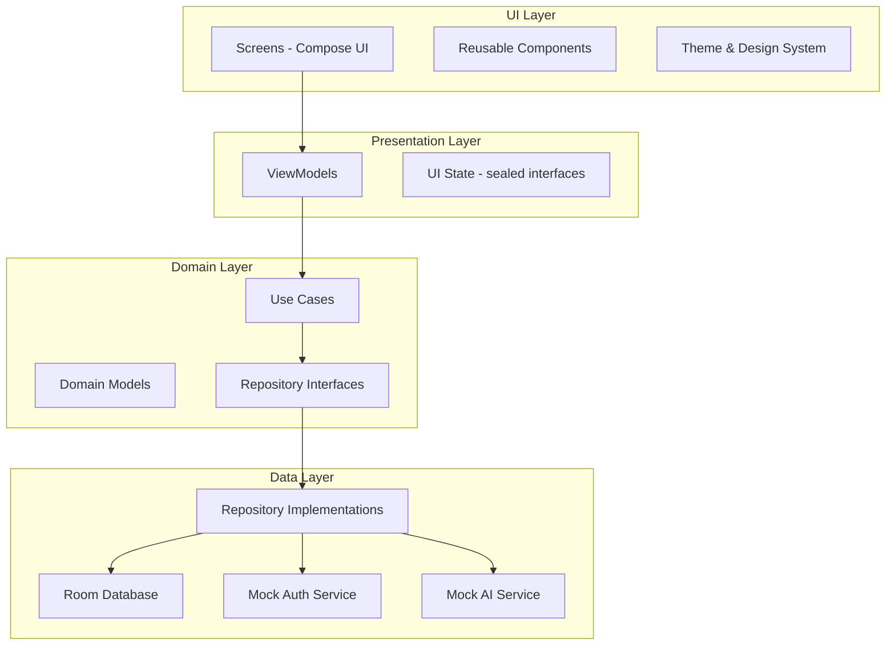
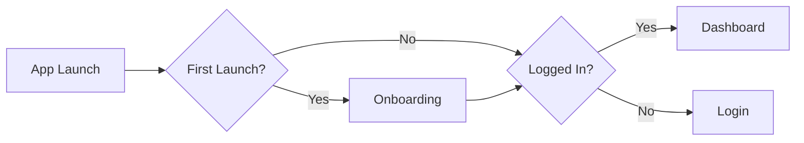

# MediLog Implementation Plan

## Project Overview

**MediLog** is an offline-first mobile application for frontline healthcare workers (FHWs) built with Kotlin Multiplatform (KMP) and Compose Multiplatform.

### Key Decisions
- **Firebase:** Mock authentication initially (no real Firebase setup)
- **Module Structure:** Single-module (`composeApp` only) for simplicity
- **Platform Priority:** Android-first, iOS support later
- **Onboarding:** 3-page carousel, shown only on first launch

---

## Architecture Overview



---

## Project Structure

```
composeApp/src/
├── androidMain/
│   └── kotlin/com/shuham/medilog/
│       ├── MainActivity.kt
│       ├── Platform.android.kt
│       └── ImagePicker.android.kt
│
├── commonMain/
│   └── kotlin/com/shuham/medilog/
│       ├── App.kt
│       ├── Platform.kt
│       │
│       ├── di/
│       │   ├── AppModule.kt
│       │   ├── DatabaseModule.kt
│       │   └── RepositoryModule.kt
│       │
│       ├── data/
│       │   ├── local/
│       │   │   ├── AppDatabase.kt
│       │   │   ├── PatientDao.kt
│       │   │   ├── RecordDao.kt
│       │   │   └── entities/
│       │   │       ├── PatientEntity.kt
│       │   │       └── RecordEntity.kt
│       │   │
│       │   ├── repository/
│       │   │   ├── PatientRepository.kt
│       │   │   ├── AuthRepository.kt
│       │   │   └── PreferencesRepository.kt
│       │   │
│       │   └── services/
│       │       ├── MockAuthService.kt
│       │       └── MockAIService.kt
│       │
│       ├── domain/
│       │   ├── model/
│       │   │   ├── Patient.kt
│       │   │   ├── Record.kt
│       │   │   ├── RiskLevel.kt
│       │   │   └── User.kt
│       │   │
│       │   └── usecase/
│       │       ├── AddPatientUseCase.kt
│       │       ├── GetPatientsUseCase.kt
│       │       ├── UpdatePatientUseCase.kt
│       │       ├── DeletePatientUseCase.kt
│       │       ├── AnalyzeImageUseCase.kt
│       │       └── LoginUseCase.kt
│       │
│       ├── presentation/
│       │   ├── navigation/
│       │   │   ├── NavRoutes.kt
│       │   │   └── NavGraph.kt
│       │   │
│       │   ├── onboarding/
│       │   │   ├── OnboardingScreen.kt
│       │   │   └── OnboardingViewModel.kt
│       │   │
│       │   ├── auth/
│       │   │   ├── LoginScreen.kt
│       │   │   └── AuthViewModel.kt
│       │   │
│       │   ├── dashboard/
│       │   │   ├── DashboardScreen.kt
│       │   │   └── DashboardViewModel.kt
│       │   │
│       │   ├── patients/
│       │   │   ├── PatientListScreen.kt
│       │   │   ├── PatientDetailScreen.kt
│       │   │   ├── AddPatientScreen.kt
│       │   │   └── PatientViewModel.kt
│       │   │
│       │   ├── scan/
│       │   │   ├── ScanScreen.kt
│       │   │   └── ScanViewModel.kt
│       │   │
│       │   └── settings/
│       │       ├── SettingsScreen.kt
│       │       └── SettingsViewModel.kt
│       │
│       ├── ui/
│       │   ├── theme/
│       │   │   ├── Color.kt
│       │   │   ├── Theme.kt
│       │   │   └── Typography.kt
│       │   │
│       │   └── components/
│       │       ├── MediLogButton.kt
│       │       ├── MediLogTextField.kt
│       │       ├── SummaryCard.kt
│       │       ├── PatientCard.kt
│       │       ├── RiskBadge.kt
│       │       └── LoadingDialog.kt
│       │
│       └── util/
│           ├── ImageCompressor.kt
│           └── DateTimeUtil.kt
│
└── iosMain/
    └── kotlin/com/shuham/medilog/
        ├── MainViewController.kt
        ├── Platform.ios.kt
        └── ImagePicker.ios.kt
```

---

## Implementation Phases

### Phase 1: Project Setup & Infrastructure

#### 1.1 Dependencies Setup
Update `gradle/libs.versions.toml` to add:
- **Koin** - Dependency Injection
- **Room KMP** - Local Database
- **Jetpack Navigation** - Navigation
- **Coil 3.0** - Image Loading
- **Kotlinx Serialization** - JSON handling
- **Kotlinx DateTime** - Date/Time handling

#### 1.2 Core Infrastructure
- Set up Koin DI modules
- Configure Room Database with entities
- Create navigation graph with routes
- Implement preferences storage (DataStore/SharedPreferences)

---

### Phase 2: Design System & Theme

#### 2.1 Color Palette
| Token | Color Code | Usage |
|-------|------------|-------|
| Primary | `#008080` | Buttons, Icons, Highlights |
| On Primary | `#FFFFFF` | Text on Primary |
| Secondary | `#E0F2F1` | Inactive buttons, Accents |
| Background | `#FFFFFF` | Screen backgrounds |
| Text Primary | `#111827` | Headlines, Body |
| Text Secondary | `#6B7280` | Captions, Subtitles |
| Error | `#EF4444` | High Risk, Errors |
| Success | `#10B981` | Normal Risk, Success |
| Warning | `#F59E0B` | Needs Review |

#### 2.2 Typography
- Font Family: System Default (Inter/San Francisco)
- Headlines: Bold, 24sp
- Body: Regular, 16sp
- Captions: Regular, 14sp

#### 2.3 UI Components
- **Cards:** White, 16dp rounded corners, soft shadow
- **Buttons:** Pill-shaped (50% rounded), 56dp height
- **TextFields:** Grey fill (`#F3F4F6`), 12dp rounded, no border

---

### Phase 3: Onboarding Flow

#### 3.1 Onboarding Screen
- HorizontalPager with 3 pages
- Pages: Offline-First, AI Triage, Secure Sync
- Skip button (top right)
- Next button (bottom)
- Store completion in preferences



---

### Phase 4: Authentication

#### 4.1 Login Screen
- Logo (teal cross) at top
- Email input field
- Password input field (min 6 chars)
- Login button
- Guest Mode button
- Forgot Password text link

#### 4.2 Mock Auth Service
- Validate email format
- Validate password strength
- Store mock session in preferences
- Support Guest Mode

---

### Phase 5: Dashboard

#### 5.1 Dashboard Components
- Top bar with title and profile avatar
- Welcome message
- Summary cards grid:
  - Total Patients
  - Pending Sync (orange)
  - High Risk Cases (red)
- Recent Activity list
- FAB for Add Patient

---

### Phase 6: Patient Management

#### 6.1 Patient List Screen
- Search bar (grey rounded box)
- Filter chips: All, High Risk, Synced
- LazyColumn of PatientCard components
- Each card shows: Avatar, Name, Age-Gender, Sync status

#### 6.2 Add/Edit Patient Form
- Name field
- Age field (number)
- Gender selector (segmented control: Male/Female/Other)
- Contact field
- Notes field (multiline)
- Save button (pinned to bottom)

#### 6.3 Patient Detail Screen
- Patient header with name and ID
- Tab layout: History | AI Scan
- Patient info section
- Edit/Delete actions

---

### Phase 7: AI Scan Feature

#### 7.1 Scan Screen
- Large camera preview area (dashed border placeholder)
- Capture button (teal, circular)
- Gallery button (white, circular)
- Result card (hidden by default)

#### 7.2 Mock AI Service
- Simulate 2-second delay
- Randomly return: NORMAL, REVIEW, or HIGH
- Generate confidence score (0.7-0.99)
- Provide explanation text

#### 7.3 Risk Display
- **Normal:** Green badge, check icon
- **Needs Review:** Orange badge, warning icon
- **High Risk:** Red badge, alert icon

---

### Phase 8: Settings & Profile

#### 8.1 Settings Screen
- Profile avatar and name
- Theme toggle (Light/Dark)
- Sync status with Sync Now button
- About App section
- Logout button (red styling)

---

### Phase 9: Offline-First Logic

#### 9.1 Data Sync Strategy
- All data stored in Room DB
- Each record has `isSynced` flag
- Mock sync status for demo purposes
- Background sync simulation

---

## Database Schema

### PatientEntity
| Field | Type | Description |
|-------|------|-------------|
| id | String | UUID primary key |
| name | String | Patient name |
| age | Int | Patient age |
| gender | String | MALE, FEMALE, OTHER |
| contact | String | Contact number |
| notes | String? | Optional notes |
| riskLevel | String | NORMAL, REVIEW, HIGH |
| isSynced | Boolean | Sync status |
| createdAt | Long | Timestamp |
| updatedAt | Long | Timestamp |

### RecordEntity
| Field | Type | Description |
|-------|------|-------------|
| id | String | UUID primary key |
| patientId | String | Foreign key to Patient |
| localImagePath | String | Local image path |
| remoteImageUrl | String? | Remote URL (mock) |
| aiResultJson | String | AI analysis result |
| timestamp | Long | Record timestamp |

---

## Navigation Routes

```kotlin
sealed class NavRoute {
    object Onboarding : NavRoute()
    object Login : NavRoute()
    object Dashboard : NavRoute()
    object PatientList : NavRoute()
    object AddPatient : NavRoute()
    data class PatientDetail(val patientId: String) : NavRoute()
    data class Scan(val patientId: String) : NavRoute()
    object Settings : NavRoute()
}
```

---

## UI State Pattern

```kotlin
sealed interface UiState<out T> {
    object Loading : UiState<Nothing>
    data class Success<T>(val data: T) : UiState<T>
    data class Error(val message: String) : UiState<Nothing>
}
```

---

## Testing Strategy

### Unit Tests
- Repository tests
- Use case tests
- Mock AI service tests

### UI Tests
- Screen rendering tests
- Navigation tests
- Form validation tests

---

## Success Criteria

1. ✅ App launches in < 2 seconds
2. ✅ All CRUD operations work offline
3. ✅ AI simulation returns color-coded results
4. ✅ Onboarding shows only on first launch
5. ✅ Guest mode allows full app access
6. ✅ Search and filter work correctly
7. ✅ Theme toggle persists across sessions
8. ✅ Code passes strict linting rules

---

## Next Steps

1. **Switch to Code mode** to begin implementation
2. Start with Phase 1: Project Setup & Infrastructure
3. Follow step-by-step with approval gates per PROTOCOLS.md

---

*Plan created: 2026-02-13*
*Ready for implementation upon approval*
